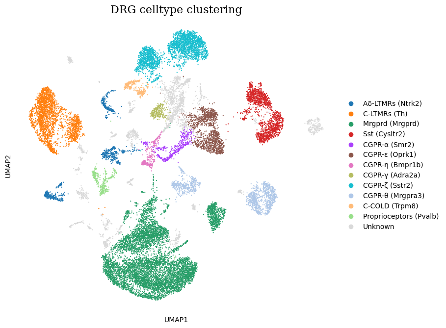
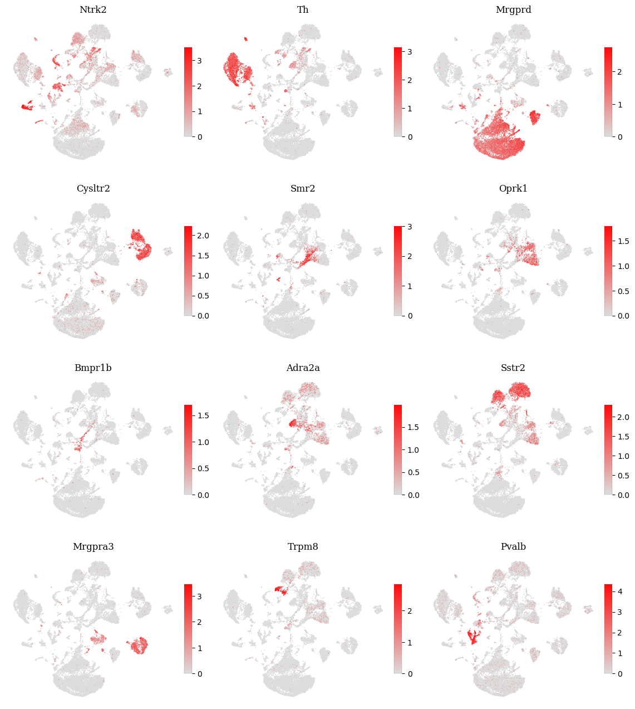
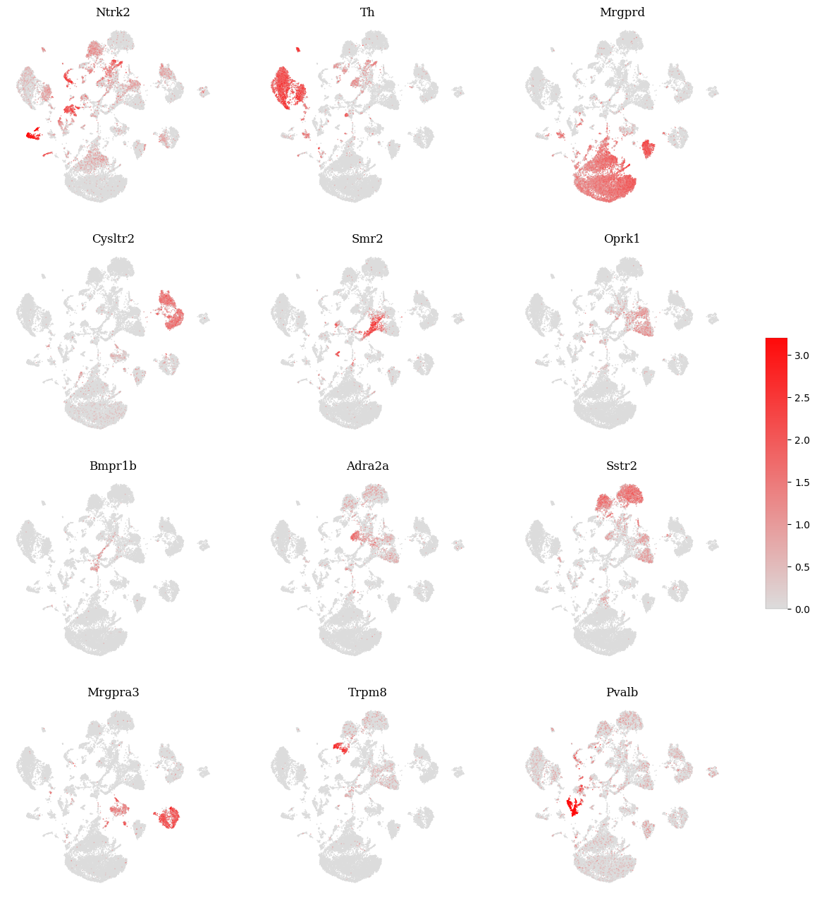
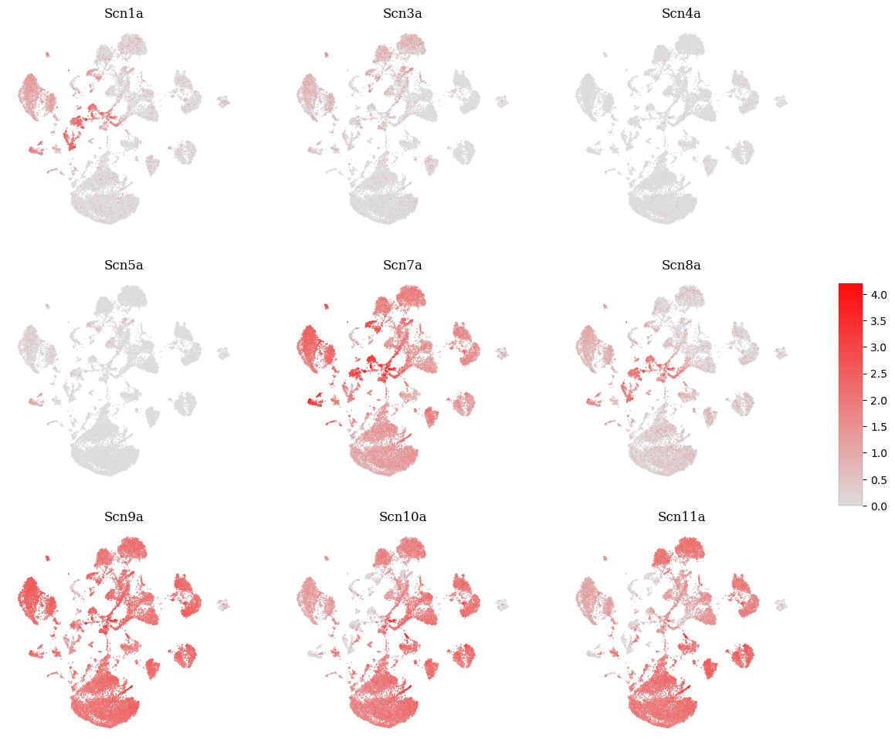

```python
import scanpy as sc
import matplotlib.pyplot as plt

adata = sc.read_h5ad("../../adata/allsample_biotype.h5ad")

gene_list = ['Th', 'Sstr2', 'Oprk1',
             'Mrgprd', 'Mrgpra3', 'Mrgpra4',
             'Bmpr1b', 'Adra2a', 'Piezo2',
             ]
```


```python
fig, ax = plt.subplots(1, 1, figsize=(9.2, 6.8))

palette = sc.pl.palettes.default_20[:12]
palette.append("#D9D9D9F1")

sc.pl.umap(
    adata,
    color='biotype',
    palette=palette,
    ax=ax,
    show=False,
    size=10
)

ax.set_title('DRG celltype clustering', fontsize=16,
             fontdict={'name': 'DejaVu Serif'},
             pad=5)

for spine in ax.spines.values():
    spine.set_visible(False)

plt.tight_layout()
plt.savefig(f'./figures/DRG celltype clustering', dpi=500, bbox_inches='tight')
plt.savefig(f'./figures/DRG celltype clustering.svg', bbox_inches='tight')
plt.savefig(f'./figures/DRG celltype clustering.pdf', dpi=500, bbox_inches='tight')
plt.show()
```


    

    


```python
for i in range(len(gene_list)):
    gene = gene_list[i]
    if (gene[0].isupper()==False):
        gene = gene.capitalize()
    gene_list[i] = gene

def var_query(key_gene):

    if key_gene in adata.var_names:
        return
    else:
        print(f"gene {key_gene} not in adata.var_names")

for gene in gene_list:
    var_query(gene)

from matplotlib.colors import LinearSegmentedColormap
grey_red = LinearSegmentedColormap.from_list('grey_red', ['#dcdcdc', "#ff0a0a"])

key_gene_list = gene_list

for key_gene in key_gene_list:

    print(f'key_gene_{key_gene} in hvg: {adata.var['highly_variable'][key_gene]}')
```

    key_gene_Th in hvg: True
    key_gene_Sstr2 in hvg: True
    key_gene_Oprk1 in hvg: True
    key_gene_Mrgprd in hvg: True
    key_gene_Mrgpra3 in hvg: True
    key_gene_Mrgpra4 in hvg: False
    key_gene_Bmpr1b in hvg: True
    key_gene_Adra2a in hvg: True
    key_gene_Piezo2 in hvg: True
    


```python
markers = ["Ntrk2", "Th", "Mrgprd", "Cysltr2", "Smr2", "Oprk1", "Bmpr1b", "Adra2a", "Sstr2", "Mrgpra3", "Trpm8", "Pvalb"]
```


```python
import colorsys

def adjust_color_saturation(hex_color, sat_factor=1.12, val_factor=0.96):
    h = hex_color.lstrip('#')
    alpha = None
    if len(h) == 8:
        alpha = h[6:8]
        h = h[:6]
    r = int(h[0:2], 16) / 255.0
    g = int(h[2:4], 16) / 255.0
    b = int(h[4:6], 16) / 255.0
    hh, ss, vv = colorsys.rgb_to_hsv(r, g, b)
    ss = min(1.0, ss * sat_factor)
    vv = max(0.0, min(1.0, vv * val_factor))
    r2, g2, b2 = colorsys.hsv_to_rgb(hh, ss, vv)
    out = '#{:02X}{:02X}{:02X}'.format(int(r2*255), int(g2*255), int(b2*255))
    if alpha:
        out = out + alpha.upper()
    return out
```


```python
import matplotlib.pyplot as plt
import numpy as np

n_genes = len(markers)
n_cols = 3
n_rows = int(np.ceil(n_genes / n_cols))

fig, axes = plt.subplots(n_rows, n_cols, figsize=(4.6*n_cols, 4*n_rows))

# 1D indexing of axes
axes = axes.flatten() if n_genes > 1 else [axes]

for idx, gene in enumerate(markers):
    sat_color = adjust_color_saturation(palette[idx], sat_factor=1.2, val_factor=1.2)
    cmap = LinearSegmentedColormap.from_list(f"cmap of {gene}", ["#dcdcdc",sat_color])
    sc.pl.umap(
        adata,
        color=gene,
        cmap=cmap,
        ax=axes[idx],
        show=False,
        colorbar_loc=None,
        # vmin=0,
        # vmax=3.2
    )
    # fig = axes[idx].get_figure()
    coll = axes[idx].collections[0]

    norm = coll.norm
    cmap = coll.cmap
    sm = plt.cm.ScalarMappable(norm=norm, cmap=cmap)

    bbox = axes[idx].get_position()

    if (True):
        cax = fig.add_axes([
            bbox.x1 + 0.0045,
            bbox.y0 + bbox.height * (1-0.6)/2,
            0.01,
            bbox.height * 0.6
        ])

        cbar = fig.colorbar(sm, cax=cax)

        cbar.outline.set_linewidth(0.1)

    axes[idx].set_title(gene)
    axes[idx].set_xlabel('')
    axes[idx].set_ylabel('')
    for spine in axes[idx].spines.keys():
        axes[idx].spines[spine].set_visible(False)
    
    axes[idx].title.set_fontname('Serif')

for idx in range(n_genes, len(axes)):
    axes[idx].axis('off')

plt.savefig('./figures/markers_palette.png', dpi=500, bbox_inches='tight')
plt.savefig('./figures/markers_palette.svg', bbox_inches='tight')
plt.savefig('./figures/markers_palette.pdf', bbox_inches='tight')
plt.show()
```


    

    


```python
import matplotlib.pyplot as plt
import numpy as np

n_genes = len(markers)
n_cols = 3
n_rows = int(np.ceil(n_genes / n_cols))

fig, axes = plt.subplots(n_rows, n_cols, figsize=(4.6*n_cols, 4*n_rows))

# 1D indexing of axes
axes = axes.flatten() if n_genes > 1 else [axes]

for idx, gene in enumerate(markers):
    cmap = grey_red
    sc.pl.umap(
        adata,
        color=gene,
        cmap=cmap,
        ax=axes[idx],
        show=False,
        colorbar_loc=None,
        # vmin=0,
        # vmax=3.2
    )
    # fig = axes[idx].get_figure()
    coll = axes[idx].collections[0]

    norm = coll.norm
    cmap = coll.cmap
    sm = plt.cm.ScalarMappable(norm=norm, cmap=cmap)

    bbox = axes[idx].get_position()

    if (True):
        cax = fig.add_axes([
            bbox.x1 + 0.0045,
            bbox.y0 + bbox.height * (1-0.6)/2,
            0.01,
            bbox.height * 0.6
        ])

        cbar = fig.colorbar(sm, cax=cax)

        cbar.outline.set_linewidth(0.1)

    axes[idx].set_title(gene)
    axes[idx].set_xlabel('')
    axes[idx].set_ylabel('')
    for spine in axes[idx].spines.keys():
        axes[idx].spines[spine].set_visible(False)
    
    axes[idx].title.set_fontname('Serif')

for idx in range(n_genes, len(axes)):
    axes[idx].axis('off')

plt.savefig('./figures/markers_single.png', dpi=500, bbox_inches='tight')
plt.savefig('./figures/markers_single.svg', bbox_inches='tight')
plt.savefig('./figures/markers_single.pdf', bbox_inches='tight')
plt.show()
```


    

    


```python
import matplotlib.pyplot as plt
import numpy as np

n_genes = len(markers)
n_cols = 3
n_rows = int(np.ceil(n_genes / n_cols))

fig, axes = plt.subplots(n_rows, n_cols, figsize=(4.4*n_cols, 4*n_rows))

# 1D indexing of axes
axes = axes.flatten() if n_genes > 1 else [axes]

for idx, gene in enumerate(markers):
    cmap = grey_red
    sc.pl.umap(
        adata,
        color=gene,
        cmap=cmap,
        ax=axes[idx],
        show=False,
        colorbar_loc=None,
        vmin=0,
        vmax=3.2
    )
    # fig = axes[idx].get_figure()
    coll = axes[idx].collections[0]

    norm = coll.norm
    cmap = coll.cmap
    print(norm.vmin, norm.vmax, cmap.name)
    sm = plt.cm.ScalarMappable(norm=norm, cmap=cmap)

    bbox = axes[idx].get_position()

    axes[idx].set_title(gene)
    axes[idx].set_xlabel('')
    axes[idx].set_ylabel('')
    for spine in axes[idx].spines.keys():
        axes[idx].spines[spine].set_visible(False)
    
    axes[idx].title.set_fontname('Serif')

cax = fig.add_axes([
    0.94,   # x
    0.36,   # y
    0.024,   # width
    0.24    # height
])

cbar = fig.colorbar(sm, cax=cax)

cbar.outline.set_linewidth(0.1)

for idx in range(n_genes, len(axes)):
    axes[idx].axis('off')

plt.savefig('./figures/markers_one.png', dpi=500, bbox_inches='tight')
plt.savefig('./figures/markers_one.svg', bbox_inches='tight')
plt.savefig('./figures/markers_one.pdf', bbox_inches='tight')
plt.show()
```

    0.0 3.2 grey_red
    0.0 3.2 grey_red
    0.0 3.2 grey_red
    0.0 3.2 grey_red
    0.0 3.2 grey_red
    0.0 3.2 grey_red
    0.0 3.2 grey_red
    0.0 3.2 grey_red
    0.0 3.2 grey_red
    0.0 3.2 grey_red
    0.0 3.2 grey_red
    0.0 3.2 grey_red
    


    

    


```python
scnXa_family = [
    "Scn1a",
    "Scn3a",
    "Scn4a",
    "Scn5a",
    "Scn7a",
    "Scn8a",
    "Scn9a",
    "Scn10a",
    "Scn11a",
]

import matplotlib.pyplot as plt
import numpy as np

n_genes = len(scnXa_family)
n_cols = 3
n_rows = int(np.ceil(n_genes / n_cols))

fig, axes = plt.subplots(n_rows, n_cols, figsize=(4.4*n_cols, 4*n_rows))

# 1D indexing of axes
axes = axes.flatten() if n_genes > 1 else [axes]

for idx, gene in enumerate(scnXa_family):
    cmap = grey_red
    sc.pl.umap(
        adata,
        color=gene,
        cmap=cmap,
        ax=axes[idx],
        show=False,
        colorbar_loc=None,
        vmin=0,
        vmax=4.2
    )
    # fig = axes[idx].get_figure()
    coll = axes[idx].collections[0]

    norm = coll.norm
    cmap = coll.cmap
    # print(norm.vmin, norm.vmax, cmap.name)
    sm = plt.cm.ScalarMappable(norm=norm, cmap=cmap)

    bbox = axes[idx].get_position()

    axes[idx].set_title(gene)
    axes[idx].set_xlabel('')
    axes[idx].set_ylabel('')
    for spine in axes[idx].spines.keys():
        axes[idx].spines[spine].set_visible(False)
    
    axes[idx].title.set_fontname('Serif')

cax = fig.add_axes([
    0.94,   # x
    0.36,   # y
    0.024,   # width
    0.24    # height
])

cbar = fig.colorbar(sm, cax=cax)

cbar.outline.set_linewidth(0.1)

for idx in range(n_genes, len(axes)):
    axes[idx].axis('off')

plt.savefig('./figures/scnXa_family.png', dpi=500, bbox_inches='tight')
plt.savefig('./figures/scnXa_family.svg', bbox_inches='tight')
plt.savefig('./figures/scnXa_family.pdf', bbox_inches='tight')
plt.show()
```


    

    

