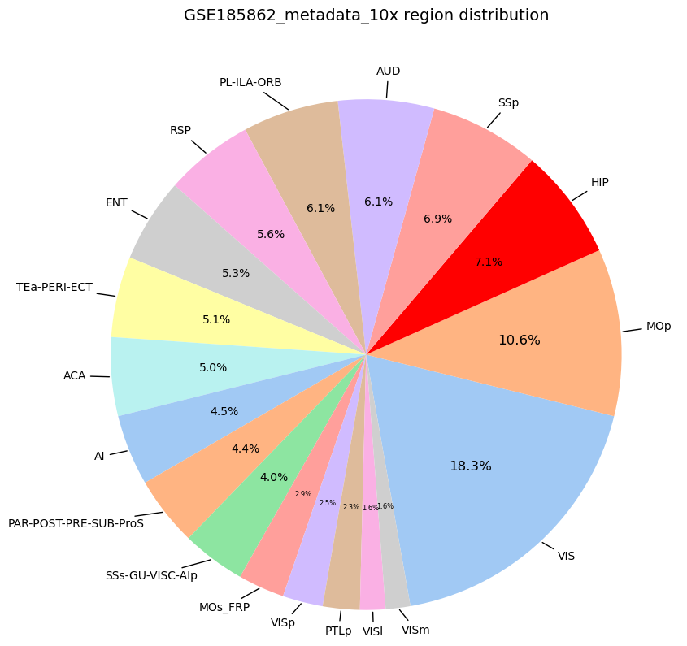
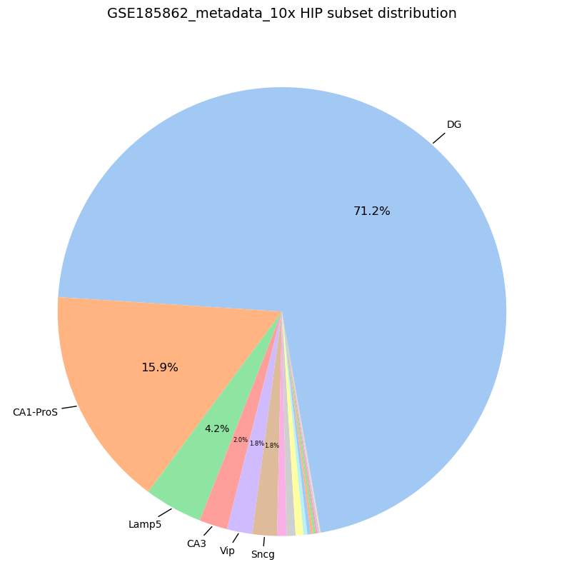
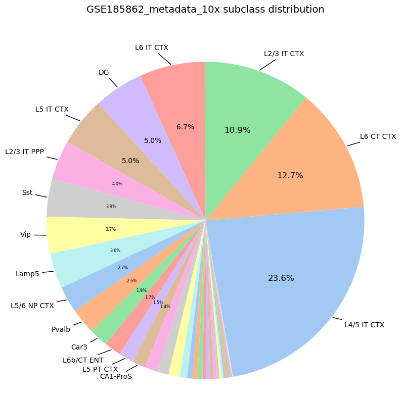
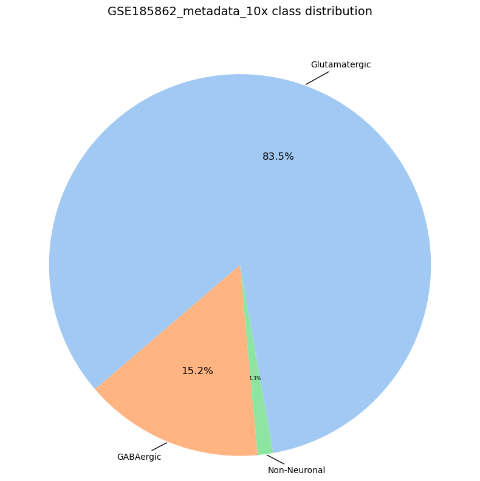
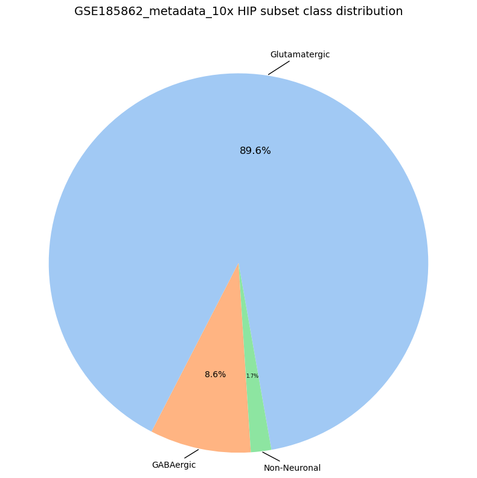

```python
import pandas as pd

meta_10x = pd.read_csv(r'..\..\source\GSE185862_metadata_10x.csv\GSE185862_metadata_10x.csv', index_col=0)
```


```python
meta_10x['region_label']
```


    1                   RSP
    2                   RSP
    3          TEa-PERI-ECT
    4          TEa-PERI-ECT
    5          TEa-PERI-ECT
                   ...     
    1169209            VISp
    1169210            VISp
    1169211            VISp
    1169212            VISp
    1169213            VISp
    Name: region_label, Length: 1169213, dtype: object


```python
meta_10x['class_label']
```


    1              GABAergic
    2          Glutamatergic
    3              GABAergic
    4              GABAergic
    5              GABAergic
                   ...      
    1169209        GABAergic
    1169210    Glutamatergic
    1169211    Glutamatergic
    1169212    Glutamatergic
    1169213    Glutamatergic
    Name: class_label, Length: 1169213, dtype: object


```python
import seaborn as sns

import numpy as np

import matplotlib.pyplot as plt

region_counts = meta_10x['region_label'].value_counts()

colors = sns.color_palette('pastel', len(region_counts))

highlight_idx = region_counts.index.get_loc('HIP')
colors = list(colors)
colors[highlight_idx] = 'red'

plt.figure(figsize=(8, 8))

def autopct_func(pct):
    return ('%1.1f%%' % pct) if pct >= 0 else ''

wedges, texts, autotexts = plt.pie(
    region_counts, labels=None, autopct=autopct_func, startangle=280,
    colors=colors, textprops={'fontsize': 10}
)

for autotext, wedge in zip(autotexts, wedges):
    ang = wedge.theta2 - wedge.theta1
    pct = ang / 360 * 100

    if pct >= 10:
        autotext.set_fontsize(12)
    elif pct >= 4:
        autotext.set_fontsize(10)
    else:
        autotext.set_fontsize(6)

plt.title('GSE185862_metadata_10x region distribution', pad=49, size=14)
plt.axis('equal')
plt.tight_layout()

for i, (wedge, label) in enumerate(zip(wedges, region_counts.index)):
    ang = (wedge.theta2 + wedge.theta1) / 2.
    x = np.cos(np.deg2rad(ang))
    y = np.sin(np.deg2rad(ang))

    if abs(x) < 0.1:
        horizontalalignment = 'center'
    else:
        horizontalalignment = 'left' if x > 0 else 'right'

    print(f"Label: {label}, Angle: {ang}, X: {x}, Y: {y} HZ: {horizontalalignment}")

    connectionstyle = "angle,angleA=0,angleB={}".format(ang)
    plt.annotate(
        label,
        xy=(x, y),
        xytext=(1.1 * x, 1.1 * y),
        horizontalalignment=horizontalalignment,
        arrowprops=dict(arrowstyle="-", connectionstyle='arc3'),
        fontsize=10
    )


plt.savefig('GSE185862_metadata_10x.png', dpi=300, bbox_inches='tight')
plt.savefig('GSE185862_metadata_10x.tiff', dpi=1000, bbox_inches='tight')
plt.savefig('GSE185862_metadata_10x.pdf', bbox_inches='tight')
plt.show()
```

    Label: VIS, Angle: 313.02159786224365, X: 0.6822739981644601, Y: -0.7310965677861457 HZ: left
    Label: MOp, Angle: 365.0909312069416, X: 0.9960551231497784, Y: 0.08873664207687669 HZ: left
    Label: HIP, Angle: 396.8449063599109, X: 0.8002616320247319, Y: 0.599650998756037 HZ: left
    Label: SSp, Angle: 422.0287702977657, X: 0.46902814347222244, Y: 0.883183220306523 HZ: left
    Label: AUD, Angle: 445.44606097042555, X: 0.07939757241892086, Y: 0.9968430295156716 HZ: center
    Label: PL-ILA-ORB, Angle: 467.31877408921713, X: -0.2976877042649662, Y: 0.9546633075223191 HZ: right
    Label: RSP, Angle: 488.3678559213876, X: -0.6207080148415172, Y: 0.7840418103082915 HZ: right
    Label: ENT, Angle: 508.06202590465546, X: -0.8486212665343551, Y: 0.5290008941255459 HZ: right
    Label: TEa-PERI-ECT, Angle: 526.8381937593222, X: -0.9737309068049541, Y: 0.2277018250537352 HZ: right
    Label: ACA, Angle: 544.999024644494, X: -0.9961961816139885, Y: -0.08713878434835638 HZ: right
    Label: AI, Angle: 562.033097743988, X: -0.9269673029090904, Y: -0.37514213218118647 HZ: right
    Label: PAR-POST-PRE-SUB-ProS, Angle: 578.0286262184381, X: -0.7877030573947316, Y: -0.6160551057908636 HZ: right
    Label: SSs-GU-VISC-AIp, Angle: 593.2029870152473, X: -0.5989818529721245, Y: -0.800762598908116 HZ: right
    Label: MOs_FRP, Angle: 605.7383418083191, X: -0.41090436382473433, Y: -0.9116784541656068 HZ: right
    Label: VISp, Angle: 615.605594329536, X: -0.24859531403321466, Y: -0.9686074384603535 HZ: right
    Label: PTLp, Angle: 624.3955070897937, X: -0.09766094128657687, Y: -0.9952197448538789 HZ: center
    Label: VISl, Angle: 631.4998244866729, X: 0.02617388607202283, Y: -0.9996574051583316 HZ: center
    Label: VISm, Angle: 637.198119033128, X: 0.12530066329871734, Y: -0.9921188153527285 HZ: left
    


    

    


```python
import seaborn as sns

import numpy as np

import matplotlib.pyplot as plt

region_counts = meta_10x[meta_10x['region_label'] == 'HIP']['subclass_label'].value_counts()

colors = sns.color_palette('pastel', len(region_counts))

plt.figure(figsize=(8, 8))

def autopct_func(pct):
    return ('%1.1f%%' % pct) if pct >= 1 else ''

wedges, texts, autotexts = plt.pie(
    region_counts, labels=None, autopct=autopct_func, startangle=280,
    colors=colors, textprops={'fontsize': 8}
)

for autotext, wedge in zip(autotexts, wedges):
    ang = wedge.theta2 - wedge.theta1
    pct = ang / 360 * 100

    if pct >= 10:
        autotext.set_fontsize(12)
        # autotext.set_fontweight('bold')
    elif pct >= 4:
        autotext.set_fontsize(10)
    else:
        autotext.set_fontsize(6)

plt.title('GSE185862_metadata_10x HIP subset distribution', pad=49, size=14)
plt.axis('equal')
plt.tight_layout()

for i, (wedge, label) in enumerate(zip(wedges, region_counts.index)):
    ang = (wedge.theta2 + wedge.theta1) / 2.
    x = np.cos(np.deg2rad(ang))
    y = np.sin(np.deg2rad(ang))

    pct = 100 * region_counts.iloc[i] / region_counts.sum()
    if pct < 1:
        continue

    if abs(x) < 0.1:
        horizontalalignment = 'center'
    else:
        horizontalalignment = 'left' if x > 0 else 'right'

    print(f"Label: {label}, Angle: {ang}, X: {x}, Y: {y} wdg: {wedge}")

    plt.annotate(
        label,
        xy=(x, y),
        xytext=(1.1 * x, 1.1 * y),
        horizontalalignment=horizontalalignment,
        arrowprops=dict(arrowstyle="-", connectionstyle='arc3'),
        fontsize=10
    )

plt.savefig('GSE185862_metadata_10x HIP subset distribution.png', dpi=300, bbox_inches='tight')
plt.savefig('GSE185862_metadata_10x HIP subset distribution.tiff', dpi=1000, bbox_inches='tight')
plt.savefig('GSE185862_metadata_10x HIP subset distribution.pdf', bbox_inches='tight')
plt.show()
```

    Label: DG, Angle: 408.1449067592621, X: 0.6672489807469748, Y: 0.7448347452234779 wdg: Wedge(center=(0, 0), r=1, theta1=280, theta2=536.29, width=None)
    Label: CA1-ProS, Angle: 564.8507878184319, X: -0.9074053134756995, Y: -0.4202565848098842 wdg: Wedge(center=(0, 0), r=1, theta1=536.29, theta2=593.412, width=None)
    Label: Lamp5, Angle: 600.95328964293, X: -0.485522492358792, Y: -0.8742241757202249 wdg: Wedge(center=(0, 0), r=1, theta1=593.412, theta2=608.495, width=None)
    Label: CA3, Angle: 612.1456318721175, X: -0.3065986454854977, Y: -0.9518388889861866 wdg: Wedge(center=(0, 0), r=1, theta1=608.495, theta2=615.796, width=None)
    Label: Vip, Angle: 619.0721476450562, X: -0.18957276578114596, Y: -0.9818666744900179 wdg: Wedge(center=(0, 0), r=1, theta1=615.796, theta2=622.348, width=None)
    Label: Sncg, Angle: 625.5363142862916, X: -0.07782722995583378, Y: -0.9969668611731294 wdg: Wedge(center=(0, 0), r=1, theta1=622.348, theta2=628.725, width=None)
    


    

    


```python
import seaborn as sns

import numpy as np

import matplotlib.pyplot as plt

region_counts = meta_10x['subclass_label'].value_counts()

colors = sns.color_palette('pastel', len(region_counts))

plt.figure(figsize=(8, 8))

def autopct_func(pct):
    return ('%1.1f%%' % pct) if pct >= 1.3 else ''

wedges, texts, autotexts = plt.pie(
    region_counts, labels=None, autopct=autopct_func, startangle=280,

    colors=colors, textprops={'fontsize': 8}
)

for autotext, wedge in zip(autotexts, wedges):
    ang = wedge.theta2 - wedge.theta1
    pct = ang / 360 * 100

    if pct >= 10:
        autotext.set_fontsize(12)
    elif pct >= 4:
        autotext.set_fontsize(10)
    else:
        autotext.set_fontsize(6)

plt.title('GSE185862_metadata_10x subclass distribution', pad=49, size=14)
plt.axis('equal')
plt.tight_layout()

for i, (wedge, label) in enumerate(zip(wedges, region_counts.index)):
    ang = (wedge.theta2 + wedge.theta1) / 2.
    x = np.cos(np.deg2rad(ang))
    y = np.sin(np.deg2rad(ang))

    pct = 100 * region_counts.iloc[i] / region_counts.sum()
    if pct < 1.3:
        continue

    if abs(x) < 0.1:
        horizontalalignment = 'center'
    else:
        horizontalalignment = 'left' if x > 0 else 'right'

    print(f"Label: {label}, Angle: {ang}, X: {x}, Y: {y} wdg: {wedge}")

    plt.annotate(
        label,
        xy=(x, y),
        xytext=(1.1 * x, 1.1 * y),
        horizontalalignment=horizontalalignment,
        arrowprops=dict(arrowstyle="-", connectionstyle='arc3'),
        fontsize=10
    )

plt.savefig('GSE185862_metadata_10x subclass distribution.png', dpi=300, bbox_inches='tight')
plt.savefig('GSE185862_metadata_10x subclass distribution.tiff', dpi=1000, bbox_inches='tight')
plt.savefig('GSE185862_metadata_10x subclass distribution.pdf', bbox_inches='tight')
plt.show()
```

    Label: L4/5 IT CTX, Angle: 322.48396188020706, X: 0.7931829059328415, Y: -0.6089834790336542 wdg: Wedge(center=(0, 0), r=1, theta1=280, theta2=364.968, width=None)
    Label: L6 CT CTX, Angle: 387.86825150251383, X: 0.8840247817075942, Y: 0.46744003393680383 wdg: Wedge(center=(0, 0), r=1, theta1=364.968, theta2=410.769, width=None)
    Label: L2/3 IT CTX, Angle: 430.46813845634455, X: 0.33433100000919075, Y: 0.9424557190833183 wdg: Wedge(center=(0, 0), r=1, theta1=410.769, theta2=450.168, width=None)
    Label: L6 IT CTX, Angle: 462.221498042345, X: -0.21169151937395783, Y: 0.977336533966241 wdg: Wedge(center=(0, 0), r=1, theta1=450.168, theta2=474.275, width=None)
    Label: DG, Angle: 483.35032597184176, X: -0.5497567407787748, Y: 0.8353248026775567 wdg: Wedge(center=(0, 0), r=1, theta1=474.275, theta2=492.425, width=None)
    Label: L5 IT CTX, Angle: 501.38368688523764, X: -0.7813428112656791, Y: 0.6241020840242768 wdg: Wedge(center=(0, 0), r=1, theta1=492.425, theta2=510.342, width=None)
    Label: L2/3 IT PPP, Angle: 517.4969871342182, X: -0.9238594080446515, Y: 0.38273201351257014 wdg: Wedge(center=(0, 0), r=1, theta1=510.342, theta2=524.652, width=None)
    Label: Sst, Angle: 531.6515854746103, X: -0.9894034558552485, Y: 0.14519229160561978 wdg: Wedge(center=(0, 0), r=1, theta1=524.652, theta2=538.651, width=None)
    Label: Vip, Angle: 545.3763557970524, X: -0.9956007154334094, Y: -0.09369746756707624 wdg: Wedge(center=(0, 0), r=1, theta1=538.651, theta2=552.101, width=None)
    Label: Lamp5, Angle: 558.589551076293, X: -0.9478265622589838, Y: -0.3187864612500299 wdg: Wedge(center=(0, 0), r=1, theta1=552.101, theta2=565.078, width=None)
    Label: L5/6 NP CTX, Angle: 569.9582750350237, X: -0.8663892931219311, Y: -0.4993691948485414 wdg: Wedge(center=(0, 0), r=1, theta1=565.078, theta2=574.839, width=None)
    Label: Pvalb, Angle: 579.5284045115113, X: -0.7713091513716468, Y: -0.6364606767195835 wdg: Wedge(center=(0, 0), r=1, theta1=574.839, theta2=584.218, width=None)
    Label: Car3, Angle: 587.6751151680946, X: -0.6733336882642931, Y: -0.7393387209178238 wdg: Wedge(center=(0, 0), r=1, theta1=584.218, theta2=591.132, width=None)
    Label: L6b/CT ENT, Angle: 594.2527704313397, X: -0.5842104227971214, Y: -0.8116022313271499 wdg: Wedge(center=(0, 0), r=1, theta1=591.132, theta2=597.373, width=None)
    Label: L5 PT CTX, Angle: 600.0303488969803, X: -0.4995412064619947, Y: -0.8662901263701988 wdg: Wedge(center=(0, 0), r=1, theta1=597.373, theta2=602.688, width=None)
    Label: CA1-ProS, Angle: 605.1348593644798, X: -0.42048388020512595, Y: -0.9073000090861023 wdg: Wedge(center=(0, 0), r=1, theta1=602.688, theta2=607.582, width=None)
    


    

    


```python
import seaborn as sns

import numpy as np

import matplotlib.pyplot as plt

region_counts = meta_10x[meta_10x['region_label'] == 'HIP']['class_label'].value_counts()
region_counts = meta_10x['class_label'].value_counts()

colors = sns.color_palette('pastel', len(region_counts))

plt.figure(figsize=(8, 8))

def autopct_func(pct):
    return ('%1.1f%%' % pct) if pct >= 1.3 else ''

wedges, texts, autotexts = plt.pie(
    region_counts, labels=None, autopct=autopct_func, startangle=280,
    colors=colors, textprops={'fontsize': 8}
)

for autotext, wedge in zip(autotexts, wedges):
    ang = wedge.theta2 - wedge.theta1
    pct = ang / 360 * 100

    if pct >= 10:
        autotext.set_fontsize(12)
    elif pct >= 4:
        autotext.set_fontsize(10)
    else:
        autotext.set_fontsize(6)

plt.title('GSE185862_metadata_10x class distribution', pad=49, size=14)
plt.axis('equal')
plt.tight_layout()

for i, (wedge, label) in enumerate(zip(wedges, region_counts.index)):
    ang = (wedge.theta2 + wedge.theta1) / 2.
    x = np.cos(np.deg2rad(ang))
    y = np.sin(np.deg2rad(ang))

    pct = 100 * region_counts.iloc[i] / region_counts.sum()
    if pct < 1.3:
        continue

    if abs(x) < 0.1:
        horizontalalignment = 'center'
    else:
        horizontalalignment = 'left' if x > 0 else 'right'

    print(f"Label: {label}, Angle: {ang}, X: {x}, Y: {y} wdg: {wedge}")

    plt.annotate(
        label,
        xy=(x, y),
        xytext=(1.1 * x, 1.1 * y),
        horizontalalignment=horizontalalignment,
        arrowprops=dict(arrowstyle="-", connectionstyle='arc3'),
        fontsize=10
    )

plt.savefig('GSE185862_metadata_10x class distribution.png', dpi=300, bbox_inches='tight')
plt.savefig('GSE185862_metadata_10x class distribution.tiff', dpi=1000, bbox_inches='tight')
plt.savefig('GSE185862_metadata_10x class distribution.pdf', bbox_inches='tight')
plt.show()
```

    Label: Glutamatergic, Angle: 430.3100275993347, X: 0.33693048214744714, Y: 0.9415295269931203 wdg: Wedge(center=(0, 0), r=1, theta1=280, theta2=580.62, width=None)
    Label: GABAergic, Angle: 607.963679432869, X: -0.3751942724556979, Y: -0.9269462001197478 wdg: Wedge(center=(0, 0), r=1, theta1=580.62, theta2=635.307, width=None)
    Label: Non-Neuronal, Angle: 637.653651162982, X: 0.13318449590482132, Y: -0.9910912622208807 wdg: Wedge(center=(0, 0), r=1, theta1=635.307, theta2=640, width=None)
    


    

    


```python
import seaborn as sns

import numpy as np

import matplotlib.pyplot as plt

region_counts = meta_10x[meta_10x['region_label'] == 'HIP']['class_label'].value_counts()

# 使用seaborn调色板
colors = sns.color_palette('pastel', len(region_counts))

# 强调'HIP'区域
# highlight_idx = region_counts.index.get_loc('HIP')
# colors = list(colors)
# colors[highlight_idx] = 'red'  # 用红色强调

plt.figure(figsize=(8, 8))

def autopct_func(pct):
    return ('%1.1f%%' % pct) if pct >= 1.3 else ''

wedges, texts, autotexts = plt.pie(
    region_counts, labels=None, autopct=autopct_func, startangle=280,
    colors=colors, textprops={'fontsize': 8}
)

for autotext, wedge in zip(autotexts, wedges):
    ang = wedge.theta2 - wedge.theta1
    pct = ang / 360 * 100

    if pct >= 10:
        autotext.set_fontsize(12)
    elif pct >= 4:
        autotext.set_fontsize(10)
    else:
        autotext.set_fontsize(6)

plt.title('GSE185862_metadata_10x HIP subset class distribution', pad=49, size=14)
plt.axis('equal')
plt.tight_layout()

for i, (wedge, label) in enumerate(zip(wedges, region_counts.index)):
    ang = (wedge.theta2 + wedge.theta1) / 2.
    x = np.cos(np.deg2rad(ang))
    y = np.sin(np.deg2rad(ang))

    pct = 100 * region_counts.iloc[i] / region_counts.sum()
    if pct < 1.3:
        continue

    if abs(x) < 0.1:
        horizontalalignment = 'center'
    else:
        horizontalalignment = 'left' if x > 0 else 'right'

    print(f"Label: {label}, Angle: {ang}, X: {x}, Y: {y} wdg: {wedge}")

    plt.annotate(
        label,
        xy=(x, y),
        xytext=(1.1 * x, 1.1 * y),
        horizontalalignment=horizontalalignment,
        arrowprops=dict(arrowstyle="-", connectionstyle='arc3'),
        fontsize=10
    )

plt.savefig('GSE185862_metadata_10x HIP subset class distribution.png', dpi=300, bbox_inches='tight')
plt.savefig('GSE185862_metadata_10x HIP subset class distribution.tiff', dpi=1000, bbox_inches='tight')
plt.savefig('GSE185862_metadata_10x HIP subset class distribution.pdf', bbox_inches='tight')
plt.show()
```

    Label: Glutamatergic, Angle: 441.3642692565918, X: 0.15015192170747518, Y: 0.9886629356901938 wdg: Wedge(center=(0, 0), r=1, theta1=280, theta2=602.729, width=None)
    Label: GABAergic, Angle: 618.2259640097618, X: -0.20405244980318163, Y: -0.9789599571633766 wdg: Wedge(center=(0, 0), r=1, theta1=602.729, theta2=633.723, width=None)
    Label: Non-Neuronal, Angle: 636.8616944178939, X: 0.11947309564646448, Y: -0.9928374385651715 wdg: Wedge(center=(0, 0), r=1, theta1=633.723, theta2=640, width=None)
    


    

    

