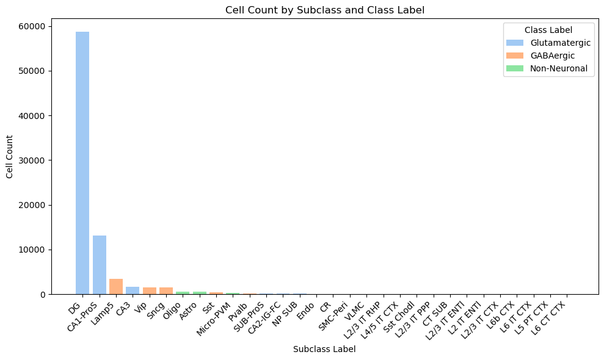
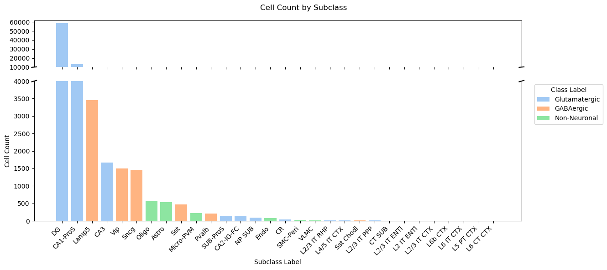
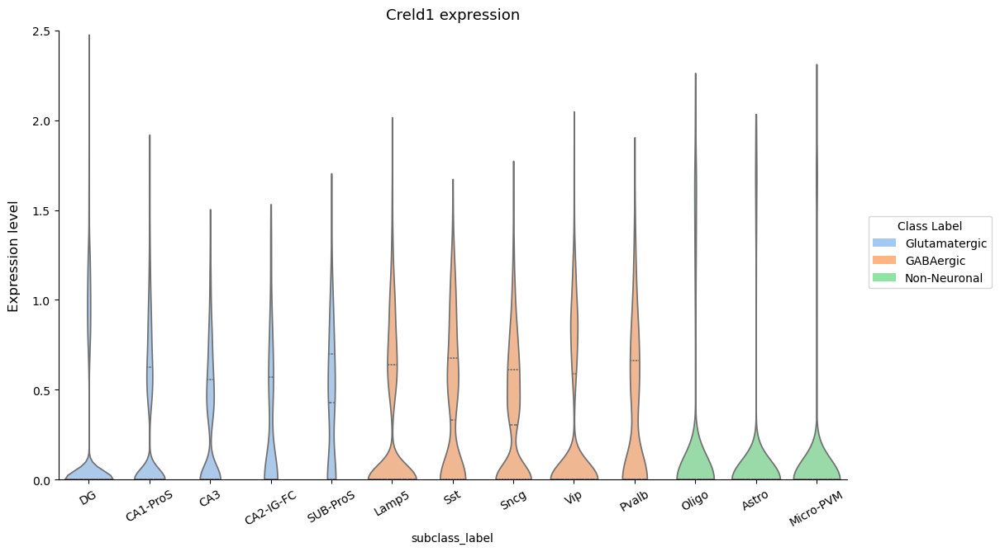
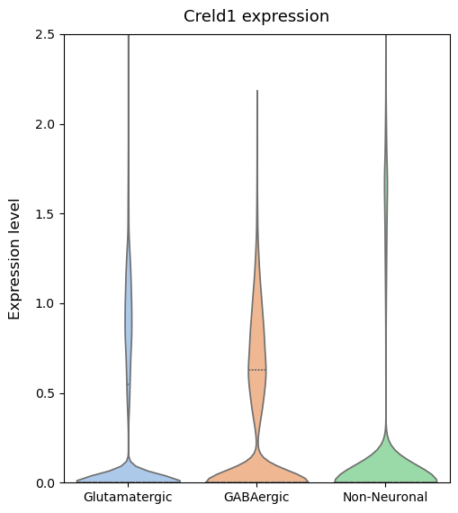
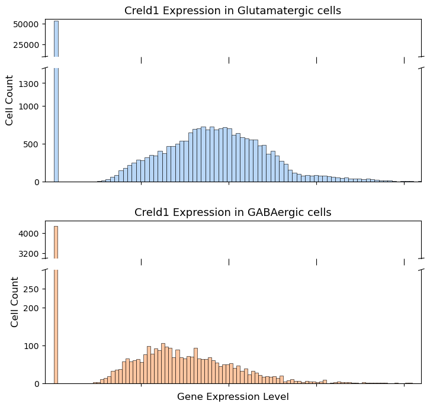

```python
import scanpy as sc

src_10x = sc.read_h5ad(r'..\meta\HIP_10x_QC.h5ad')
```


```python
import seaborn as sns

colors = sns.color_palette('pastel')
```


```python
colors
```


<svg  width="550" height="55"><rect x="0" y="0" width="55" height="55" style="fill:#a1c9f4;stroke-width:2;stroke:rgb(255,255,255)"/><rect x="55" y="0" width="55" height="55" style="fill:#ffb482;stroke-width:2;stroke:rgb(255,255,255)"/><rect x="110" y="0" width="55" height="55" style="fill:#8de5a1;stroke-width:2;stroke:rgb(255,255,255)"/><rect x="165" y="0" width="55" height="55" style="fill:#ff9f9b;stroke-width:2;stroke:rgb(255,255,255)"/><rect x="220" y="0" width="55" height="55" style="fill:#d0bbff;stroke-width:2;stroke:rgb(255,255,255)"/><rect x="275" y="0" width="55" height="55" style="fill:#debb9b;stroke-width:2;stroke:rgb(255,255,255)"/><rect x="330" y="0" width="55" height="55" style="fill:#fab0e4;stroke-width:2;stroke:rgb(255,255,255)"/><rect x="385" y="0" width="55" height="55" style="fill:#cfcfcf;stroke-width:2;stroke:rgb(255,255,255)"/><rect x="440" y="0" width="55" height="55" style="fill:#fffea3;stroke-width:2;stroke:rgb(255,255,255)"/><rect x="495" y="0" width="55" height="55" style="fill:#b9f2f0;stroke-width:2;stroke:rgb(255,255,255)"/></svg>


```python
import pandas as pd

HIP = pd.read_csv(r'..\meta\HIP_10x.csv')

display(HIP['class_label'].unique())

target_cells_dict = {}
subclass_dict = {}

for index, row in HIP.iterrows():

    barcode = row['sample_name']
    subclass = row['subclass_label']

    # print(f'barcode = {barcode}')

    if (barcode not in target_cells_dict):
        target_cells_dict[barcode] = row['class_label']
    
    if (subclass not in subclass_dict):
        subclass_dict[subclass] = row['class_label']
    elif (subclass_dict[subclass] != row['class_label']):
        print(f'Subclass {subclass} has mixed labels: {subclass_dict[subclass]} and {row["class_label"]}')
```


    array(['GABAergic', 'Glutamatergic', 'Non-Neuronal'], dtype=object)


```python
adata = src_10x.copy()

adata.obs['class_label'] = 'Unknown'

for index, row in adata.obs.iterrows():
    adata.obs.at[index, 'class_label'] = target_cells_dict.get(index, 'Unknown')

adata.obs['class_label'].unique()
```


    array(['Glutamatergic', 'GABAergic', 'Non-Neuronal'], dtype=object)


```python
import pandas as pd

count_df = (
    adata.obs.groupby(["class_label", "subclass_label"])
    .size()
    .reset_index(name="cell_count")
    .sort_values(["class_label", "cell_count"], ascending=[True, False])
)

print(count_df)

subclass_counts = (
    adata.obs["subclass_label"]
    .value_counts()
    .rename_axis("subclass_label")
    .reset_index(name="cell_count")
)
print(subclass_counts)

```

         class_label subclass_label  cell_count
    18     GABAergic          Lamp5        3458
    29     GABAergic            Vip        1502
    25     GABAergic           Sncg        1462
    26     GABAergic            Sst         466
    22     GABAergic          Pvalb         207
    ..           ...            ...         ...
    84  Non-Neuronal       SUB-ProS           0
    85  Non-Neuronal           Sncg           0
    86  Non-Neuronal            Sst           0
    87  Non-Neuronal      Sst Chodl           0
    89  Non-Neuronal            Vip           0
    
    [90 rows x 3 columns]
       subclass_label  cell_count
    0              DG       58758
    1        CA1-ProS       13096
    2           Lamp5        3458
    3             CA3        1674
    4             Vip        1502
    5            Sncg        1462
    6           Oligo         560
    7           Astro         534
    8             Sst         466
    9       Micro-PVM         225
    10          Pvalb         207
    11       SUB-ProS         146
    12      CA2-IG-FC         137
    13         NP SUB          91
    14           Endo          74
    15             CR          35
    16       SMC-Peri          26
    17           VLMC          20
    18    L2/3 IT RHP          15
    19    L4/5 IT CTX          12
    20      Sst Chodl          11
    21    L2/3 IT PPP           9
    22         CT SUB           7
    23   L2/3 IT ENTl           4
    24     L2 IT ENTl           1
    25    L2/3 IT CTX           1
    26        L6b CTX           1
    27      L6 IT CTX           1
    28      L5 PT CTX           1
    29      L6 CT CTX           1
    

    C:\Users\14028\AppData\Local\Temp\ipykernel_20796\2518753435.py:4: FutureWarning: The default of observed=False is deprecated and will be changed to True in a future version of pandas. Pass observed=False to retain current behavior or observed=True to adopt the future default and silence this warning.
      adata.obs.groupby(["class_label", "subclass_label"])
    


```python
import matplotlib.pyplot as plt

color_map = {
    'Glutamatergic': colors[0],
    'GABAergic': colors[1],
    'Non-Neuronal': colors[2]
}

x_labels = subclass_counts['subclass_label']
y_values = subclass_counts['cell_count']
color_ = [color_map[subclass_dict[cls]] for cls in subclass_counts['subclass_label']]

plt.figure(figsize=(10, 6))
bars = plt.bar(x_labels, y_values, color=color_)

plt.xlabel('Subclass Label')
plt.ylabel('Cell Count')
plt.title('Cell Count by Subclass and Class Label')
plt.xticks(rotation=45, ha='right')

from matplotlib.patches import Patch

legend_elements = [Patch(facecolor=color_map[cls], label=cls) for cls in color_map]
plt.legend(handles=legend_elements, title='Class Label')

plt.savefig('violin/subclass_count.png', dpi=300, bbox_inches='tight')
plt.savefig('violin/subclass_count.tiff', dpi=1000, bbox_inches='tight')

plt.tight_layout()
plt.show()
```


    

    


```python
import matplotlib.pyplot as plt
from matplotlib.patches import Patch

color_map = {
    'Glutamatergic': colors[0],
    'GABAergic': colors[1],
    'Non-Neuronal': colors[2]
}

x_labels = subclass_counts['subclass_label']
y_values = subclass_counts['cell_count']
color_ = [color_map[subclass_dict[cls]] for cls in subclass_counts['subclass_label']]

fig, (ax1, ax2) = plt.subplots(2, 1, sharex=True, figsize=(13.4, 6), gridspec_kw={'height_ratios': [1, 3]})

break_start = 4000
break_end = 10000

ax1.bar(x_labels, y_values, color=color_)
ax1.set_ylim(break_end, max(y_values)*1.05)

ax2.bar(x_labels, y_values, color=color_)
ax2.set_ylim(0, break_start)

ax1.spines['bottom'].set_visible(False)
ax2.spines['top'].set_visible(False)
ax1.tick_params(labeltop=False)
ax2.xaxis.tick_bottom()

d = .005
kwargs = dict(transform=ax1.transAxes, color='k', clip_on=False)
ax1.plot((-d, +d), (-d, +d), **kwargs)
ax1.plot((1 - d, 1 + d), (-d, +d), **kwargs)

kwargs.update(transform=ax2.transAxes)
ax2.plot((-d, +d), (1 - d, 1 + d), **kwargs)
ax2.plot((1 - d, 1 + d), (1 - d, 1 + d), **kwargs)

ax2.set_xlabel('Subclass Label')

ax1.set_yticks([10000, 20000, 30000, 40000, 50000, 60000])

# ax1.set_ylabel('Cell Count')
ax2.set_ylabel('Cell Count')
plt.xticks(rotation=45, ha='right')
plt.suptitle('Cell Count by Subclass')

legend_elements = [Patch(facecolor=color_map[cls], label=cls) for cls in color_map]
plt.legend(handles=legend_elements, title='Class Label', bbox_to_anchor=(1.02, 1), loc='upper left')

plt.tight_layout()
plt.subplots_adjust(hspace=0.15)

plt.savefig('violin/subclass_count_break.png', dpi=300, bbox_inches='tight')
plt.savefig('violin/subclass_count_break.tiff', dpi=1000, bbox_inches='tight')
plt.savefig('violin/subclass_count_break.pdf', bbox_inches='tight')

plt.show()

```


    

    


```python
adata = sc.read_h5ad(r'..\meta\HIP_10x_QC_class_label.h5ad')
```


```python
import pandas as pd

subclass_counts = adata.obs["subclass_label"].value_counts()

valid_subclasses = subclass_counts[subclass_counts >= 100].index

print(f"细胞数 >= 100 的 subclass: {valid_subclasses.tolist()}")

adata_filtered = adata[adata.obs["subclass_label"].isin(valid_subclasses)].copy()

print(f"过滤后剩余 {adata_filtered.n_obs} 个细胞，"
      f"{adata_filtered.obs['subclass_label'].nunique()} 个 subclass_label")

```

    细胞数 >= 100 的 subclass: ['DG', 'CA1-ProS', 'Lamp5', 'CA3', 'Vip', 'Sncg', 'Oligo', 'Astro', 'Sst', 'Micro-PVM', 'Pvalb', 'SUB-ProS', 'CA2-IG-FC']
    过滤后剩余 82225 个细胞，13 个 subclass_label
    


```python
import pandas as pd
import seaborn as sns
import matplotlib.pyplot as plt
from matplotlib.ticker import FixedLocator

key_gene = "Creld1"

adata = adata_filtered.copy()

if key_gene not in adata.var_names:
    raise ValueError(f"{key_gene} 不在 adata.var_names 中，请检查基因名是否正确")

class_order = ['Glutamatergic', 'GABAergic', 'Non-Neuronal']

df = pd.DataFrame({
    "expression": (
        adata[:, key_gene].X.toarray().flatten()
        if hasattr(adata[:, key_gene].X, "toarray")
        else adata[:, key_gene].X.flatten()
    ),
    "subclass_label": adata.obs["subclass_label"].values,
    "class_label": adata.obs["class_label"].values
})

df["class_label"] = pd.Categorical(df["class_label"], categories=class_order, ordered=True)

subclass_order = (
    df.groupby("class_label")["subclass_label"]
    .unique()
    .loc[class_order]
    .explode()
    .tolist()
)

fig, ax = plt.subplots(1, 1, figsize=(12.2, 6.8))

sns.violinplot(
    data=df,
    x="subclass_label",
    y="expression",
    hue="class_label",
    hue_order=class_order,
    order=subclass_order,
    palette={
        'Glutamatergic': colors[0],
        'GABAergic': colors[1],
        'Non-Neuronal': colors[2]
    },
    cut=0,
    # inner="box",
    inner="quart",
    alpha=0.99,
    ax=ax
)

ax.set_ylabel("Expression level", fontsize=12, labelpad=10)
ax.set_ylim(0, 2.5)
ax.set_title(f"{key_gene} expression", fontsize=13, pad=10)

ax.spines['top'].set_visible(False)
ax.spines['right'].set_visible(False)

legend_elements = [Patch(facecolor=color_map[cls], label=cls) for cls in color_map]
plt.legend(handles=legend_elements, title='Class Label', bbox_to_anchor=(1.02, 0.6), loc='upper left')

plt.xticks(rotation=30, ha='center')

plt.savefig(f"violin/{key_gene}_violin.png", dpi=300, bbox_inches='tight')
plt.savefig(f"violin/{key_gene}_violin.tiff", dpi=1000, bbox_inches='tight')
plt.savefig(f"violin/{key_gene}_violin.pdf", bbox_inches='tight')

plt.tight_layout()
plt.show()

```

    C:\Users\14028\AppData\Local\Temp\ipykernel_20796\3129451834.py:28: FutureWarning: The default of observed=False is deprecated and will be changed to True in a future version of pandas. Pass observed=False to retain current behavior or observed=True to adopt the future default and silence this warning.
      df.groupby("class_label")["subclass_label"]
    


    

    


```python
import pandas as pd
import seaborn as sns
import matplotlib.pyplot as plt
from matplotlib.ticker import FixedLocator

key_gene = "Creld1"

adata = adata_filtered.copy()

if key_gene not in adata.var_names:
    raise ValueError(f"{key_gene} 不在 adata.var_names 中，请检查基因名是否正确")

class_order = ['Glutamatergic', 'GABAergic', 'Non-Neuronal']

df = pd.DataFrame({
    "expression": (
        adata[:, key_gene].X.toarray().flatten()
        if hasattr(adata[:, key_gene].X, "toarray")
        else adata[:, key_gene].X.flatten()
    ),
    "class_label": adata.obs["class_label"].values
})

df["class_label"] = pd.Categorical(df["class_label"], categories=class_order, ordered=True)

fig, ax = plt.subplots(1, 1, figsize=(5.2, 5.8))

sns.violinplot(
    data=df,
    x="class_label",
    y="expression",
    hue="class_label",
    hue_order=class_order,
    order=class_order,
    palette={
        'Glutamatergic': colors[0],
        'GABAergic': colors[1],
        'Non-Neuronal': colors[2]
    },
    inner="quart",
    alpha=0.99,
    ax=ax
)

ax.set_xlabel(None)
ax.set_ylabel("Expression level", fontsize=12, labelpad=10)
ax.set_ylim(0, 2.5)
ax.set_title(f"{key_gene} expression", fontsize=13, pad=10)

plt.savefig(f"violin/{key_gene}_violin_class.png", dpi=300, bbox_inches='tight')
plt.savefig(f"violin/{key_gene}_violin_class.tiff", dpi=1000, bbox_inches='tight')
plt.savefig(f"violin/{key_gene}_violin_class.pdf", bbox_inches='tight')

plt.tight_layout()
plt.show()

```


    

    


```python
import pandas as pd
import seaborn as sns
import matplotlib.pyplot as plt
from matplotlib.patches import Patch

key_gene = "Creld1"

adata = adata_filtered.copy()

if key_gene not in adata.var_names:
    raise ValueError(f"{key_gene} 不在 adata.var_names 中，请检查基因名是否正确")

class_order = ['Glutamatergic', 'GABAergic', 'Non-Neuronal']

df = pd.DataFrame({
    "expression": (
        adata[:, key_gene].X.toarray().flatten()
        if hasattr(adata[:, key_gene].X, "toarray")
        else adata[:, key_gene].X.flatten()
    ),
    "class_label": adata.obs["class_label"].values
})

df["class_label"] = pd.Categorical(df["class_label"], categories=class_order, ordered=True)

color_map = {
    'Glutamatergic': colors[0],
    'GABAergic': colors[1],
    'Non-Neuronal': colors[2]
}

import matplotlib.gridspec as gridspec

fig = plt.figure(figsize=(8.2, 8))

outer = gridspec.GridSpec(2, 1, hspace=0.24) 

axs = []
for i in range(2):
    inner = gridspec.GridSpecFromSubplotSpec(2, 1,
                    subplot_spec=outer[i], 
                    height_ratios=[1, 3], 
                    hspace=0.15) 
    
    ax_top = plt.subplot(inner[0])
    ax_bottom = plt.subplot(inner[1], sharex=ax_top)
    axs.extend([ax_top, ax_bottom])

for i, class_label in enumerate(class_order[:2]):

    if (i==0):
        break_start = 1500
        break_end = 10000
    else:
        break_start = 300
        break_end = 3000

    ax1 = axs[2 * i]
    ax2 = axs[2 * i + 1]
    
    df_class = df[df["class_label"] == class_label]
    
    sns.histplot(df_class['expression'], kde=False, bins=100, ax=ax1, color=color_map[class_label])

    ax1.set_title(f"{key_gene} Expression in {class_label} cells", fontsize=13)

    ax1.set_ylim(break_end, df_class['expression'].value_counts().max()*1.05)
    
    sns.histplot(df_class['expression'], kde=False, bins=100, ax=ax2, color=color_map[class_label])
    
    ax2.set_ylabel("Cell Count", fontsize=12)
    ax2.yaxis.label.set_position((-0.1, 0.72))

    ax2.set_ylim(0, break_start)
    
    ax2.set_xlim(-0.05, 2.1)
    ax1.set_xlim(-0.05, 2.1)

    ax1.spines['bottom'].set_visible(False)
    ax1.set_xlabel(None)
    ax1.set_ylabel(None)
    ax1.set_xticks([0.5, 1, 1.5, 2])
    ax1.set_xticklabels([])

    ax1.tick_params(axis='x', length=8)

    ax2.spines['top'].set_visible(False)
    ax2.set_title(None)
    ax2.set_xlabel(None)

    d = .0075; lwd = 0.8
    kwargs = dict(transform=ax1.transAxes, color='k', clip_on=False)
    ax1.plot((-d, +d), (-d, +d), linewidth=lwd, **kwargs)
    ax1.plot((1 - d, 1 + d), (-d, +d),  linewidth=lwd, **kwargs)
    
    kwargs.update(transform=ax2.transAxes)
    ax2.plot((-d, +d), (1 - d, 1 + d), linewidth=lwd, **kwargs)
    ax2.plot((1 - d, 1 + d), (1 - d, 1 + d), linewidth=lwd, **kwargs)

    # manually adjust ticks layout
    if (i==0):
        ax2.yaxis.set_major_locator(FixedLocator([0, 500, 1000, 1300]))
    else:
        ax1.yaxis.set_major_locator(FixedLocator([3200, 4000]))
        ax2.yaxis.set_major_locator(FixedLocator([0, 100, 200, 250]))

plt.xlabel("Gene Expression Level", fontsize=12)

plt.subplots_adjust(hspace=0.4)

plt.savefig(f"violin/{key_gene}_histograms_class_break.png", dpi=1000, bbox_inches='tight')
plt.savefig(f"violin/{key_gene}_histograms_class_break.tiff", dpi=1000, bbox_inches='tight')
plt.savefig(f"violin/{key_gene}_histograms_class_break.pdf", bbox_inches='tight')

plt.show()

```


    

    


```python
gene_expr = adata[:, key_gene].X

import numpy as np
if not isinstance(gene_expr, np.ndarray):
    gene_expr = gene_expr.toarray().flatten() if hasattr(gene_expr, 'toarray') else np.array(gene_expr).flatten()

display(gene_expr)

print(f"Mean: {np.mean(gene_expr)}")
print(f"Median: {np.median(gene_expr)}")
print(f"Max: {np.max(gene_expr)}")
print(f"Min: {np.min(gene_expr)}")
print(f"Non-zero count: {np.sum(gene_expr > 0)}")
```


    array([0.        , 0.        , 0.60979474, ..., 1.6701819 , 0.        ,
           0.6158779 ], dtype=float32)


    Mean: 0.25834396481513977
    Median: 0.0
    Max: 2.476969003677368
    Min: 0.0
    Non-zero count: 23246
    


```python
import numpy as np
expr = adata[:, 'Malat1'].X
if hasattr(expr, 'toarray'):
    expr = expr.toarray().flatten()
else:
    expr = expr.flatten()

print(f"min: {expr.min()}, max: {expr.max()}, mean: {expr.mean():.2f}")
```

    min: 0.8325644731521606, max: 8.037652969360352, mean: 5.64
    
