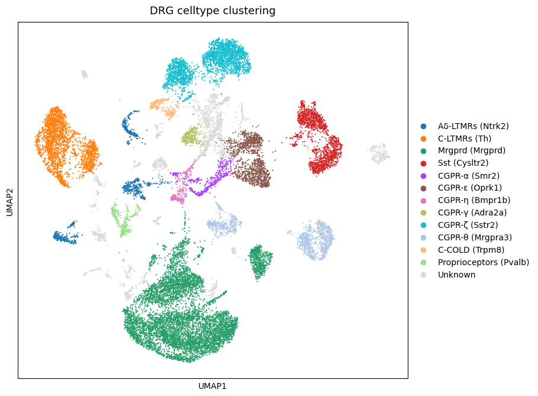
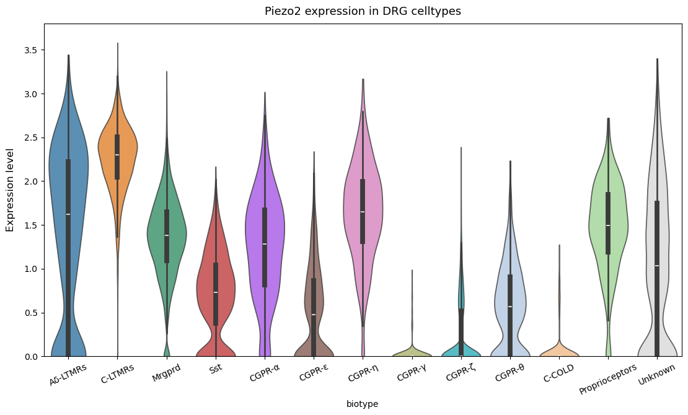
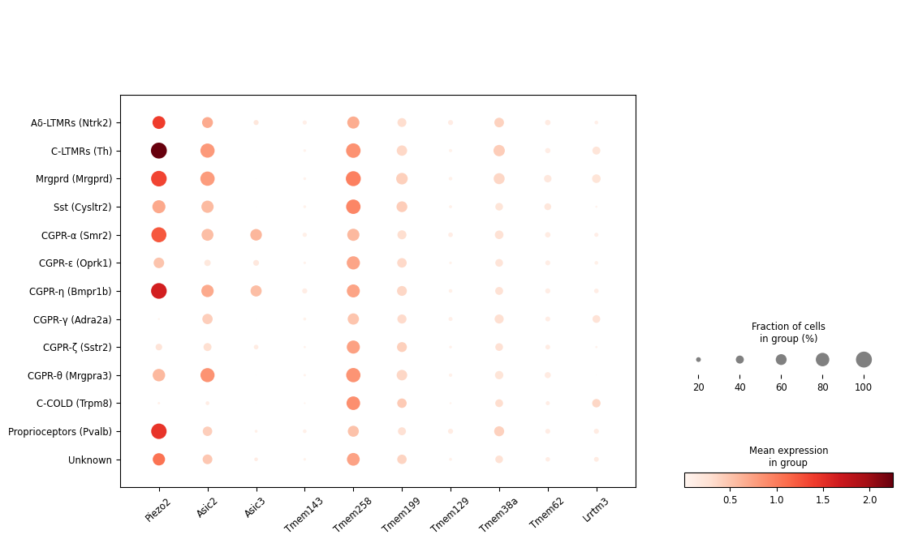

```python
import scanpy as sc

src = sc.read_h5ad("../../adata/allsample_biotype.h5ad")
```


```python
sc.pl.palettes.default_20[:12]
```


    ['#1f77b4',
     '#ff7f0e',
     '#279e68',
     '#d62728',
     '#aa40fc',
     '#8c564b',
     '#e377c2',
     '#b5bd61',
     '#17becf',
     '#aec7e8',
     '#ffbb78',
     '#98df8a']


```python
import matplotlib.pyplot as plt

adata = src.copy()

fig, ax = plt.subplots(1, 1, figsize=(9.2, 6.8))

palette = sc.pl.palettes.default_20[:12]
palette.append("#D9D9D9F1")

sc.pl.umap(
    adata,
    color='biotype',
    palette=palette,
    ax=ax,
    show=False,
    size=10
)

ax.set_title('DRG celltype clustering', fontsize=13, pad=10)
plt.tight_layout()
plt.savefig(f'./figure/DRG celltype clustering', dpi=300, bbox_inches='tight')
plt.show()
```


    

    


```python
import re
from matplotlib.ticker import FixedLocator

key_gene_list = [
    "Piezo2", "Asic2", "Asic3",
    "Tmem143", "Tmem258", "Tmem199",
    "Tmem129", "Tmem38a", "Tmem62",
    "Lrrtm3"
]

first_time = True

for key_gene in key_gene_list:

    fig, ax = plt.subplots(1, 1, figsize=(11.2, 6.8))

    if key_gene not in adata.var_names:
        print(f"{key_gene} 不在 adata.var_names 中，请检查基因名是否正确")
        plt.close(fig)
        continue

    sc.pl.violin(
        adata,
        keys=key_gene,
        groupby='biotype',
        stripplot=False, jitter=True,
        multi_panel=False,
        show=False,
        ax=ax,
        alpha=0.8,
        inner='box'
    )

    ax = plt.gca()
    original_labels = [tick.get_text() for tick in ax.get_xticklabels()]
    clean_labels = [re.sub(r'\s*\(.*?\)', '', label) for label in original_labels]

    ax.xaxis.set_major_locator(FixedLocator(range(len(clean_labels))))
    ax.set_xticklabels(clean_labels, rotation=25, ha='center')
    ax.set_ylabel('Expression level', fontsize=12, labelpad=10)
    ax.set_ylim(0, 3.8)
    ax.set_title(f'{key_gene} expression in DRG celltypes', fontsize=13, pad=10)

    plt.tight_layout()
    # plt.savefig(f'./figure/{key_gene} expression in DRG celltypes', dpi=300, bbox_inches='tight')
    # plt.savefig(f'../figure/{key_gene} expression in DRG celltypes.pdf', bbox_inches='tight')
    if first_time:
        plt.show()
        first_time = False
        plt.close(fig)
    else:
        plt.close(fig)

```


    

    


```python
import scanpy as sc
import matplotlib.pyplot as plt
from matplotlib.ticker import FixedLocator

fig, ax = plt.subplots(1, 1, figsize=(11.2, 6.8))

for key_gene in key_gene_list:

    if key_gene not in adata.var_names:
        print(f"{key_gene} 不在 adata.var_names 中，请检查基因名是否正确")
        continue

dotplot = sc.pl.dotplot(adata,
                        var_names=key_gene_list, groupby='biotype',
                        color_map='Reds',
                        linewidth=0,
                        ax=ax, return_fig=True)

dotplot.make_figure()

for key, ax in dotplot.ax_dict.items():
    
    display(key)
    
    if (key=='mainplot_ax'):
        for label in ax.get_xticklabels():
            label.set_x(label.get_position()[0] + 10) 
        plt.setp(ax.get_xticklabels(), rotation=42, ha='center')

plt.tight_layout()
# plt.savefig(r'..\dotplot\dotplot_interested_genes.pdf')
plt.savefig(r'.\figure\dotplot.png', dpi=300)
plt.show()
```


    'mainplot_ax'


    'size_legend_ax'


    'color_legend_ax'


    

    

