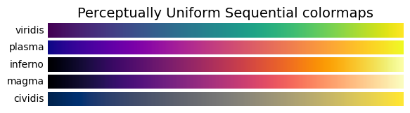
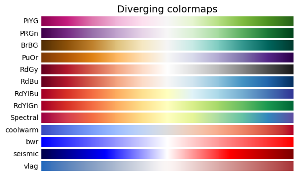
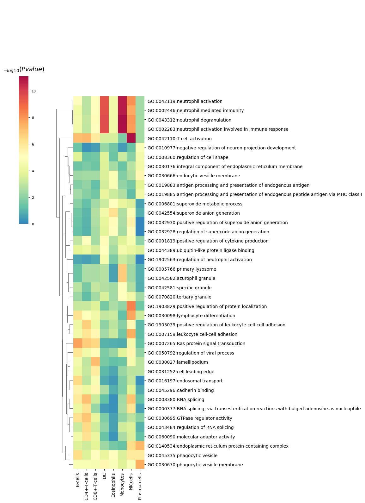

```python
import pandas as pd

#load data from pkl
data = pd.read_pickle("../meta/GO_enrichment_downregulated_genes.pkl")
```


```python
Groups = data.keys()
```


```python
GO_terms = set()
GO_terms_list = []
GO_dict = {}

for g in Groups:
    df = data[g]

    for go in df['ID'].head(8).values:
        if (go not in GO_terms_list):
            GO_terms_list.append(go)
            GO_dict[go] = df[df['ID'] == go]['Description'].values[0]

for go in GO_terms_list:
    print(go, GO_dict[go])

```

    GO:0007265 Ras protein signal transduction
    GO:0042110 T cell activation
    GO:0016197 endosomal transport
    GO:0045335 phagocytic vesicle
    GO:0030695 GTPase regulator activity
    GO:0030098 lymphocyte differentiation
    GO:0050792 regulation of viral process
    GO:0008380 RNA splicing
    GO:1903039 positive regulation of leukocyte cell-cell adhesion
    GO:0043484 regulation of RNA splicing
    GO:0060090 molecular adaptor activity
    GO:0000377 RNA splicing, via transesterification reactions with bulged adenosine as nucleophile
    GO:0030027 lamellipodium
    GO:0031252 cell leading edge
    GO:0045296 cadherin binding
    GO:0007159 leukocyte cell-cell adhesion
    GO:0043312 neutrophil degranulation
    GO:0002283 neutrophil activation involved in immune response
    GO:0002446 neutrophil mediated immunity
    GO:0042119 neutrophil activation
    GO:0030670 phagocytic vesicle membrane
    GO:0001819 positive regulation of cytokine production
    GO:0044389 ubiquitin-like protein ligase binding
    GO:1902563 regulation of neutrophil activation
    GO:0042554 superoxide anion generation
    GO:0032930 positive regulation of superoxide anion generation
    GO:0032928 regulation of superoxide anion generation
    GO:0006801 superoxide metabolic process
    GO:0030666 endocytic vesicle membrane
    GO:0019883 antigen processing and presentation of endogenous antigen
    GO:0005766 primary lysosome
    GO:0042582 azurophil granule
    GO:0042581 specific granule
    GO:0070820 tertiary granule
    GO:1903829 positive regulation of protein localization
    GO:0140534 endoplasmic reticulum protein-containing complex
    GO:0010977 negative regulation of neuron projection development
    GO:0008360 regulation of cell shape
    GO:0019885 antigen processing and presentation of endogenous peptide antigen via MHC class I
    GO:0030176 integral component of endoplasmic reticulum membrane
    


```python
import numpy as np

sheet = pd.DataFrame(index=GO_terms_list, columns=Groups)

for g in Groups:
    df = data[g]
    for go in GO_terms_list:
        if (go in df['ID'].values):
            sheet.loc[go, g] = -np.log10(df[df['ID'] == go]['pvalue'].values[0])
        else:
            sheet.loc[go, g] = 0

sheet = sheet.apply(pd.to_numeric, errors='coerce')

# display(sheet)
```


```python
import numpy as np

import matplotlib.pyplot as plt

gradient = np.linspace(0, 1, 256)
gradient = np.vstack((gradient, gradient))

def plot_color_gradients(cmap_category, cmap_list):
    # Create figure and adjust figure height to number of colormaps
    nrows = len(cmap_list)
    figh = 0.35 + 0.15 + (nrows + (nrows-1)*0.1)*0.22
    fig, axes = plt.subplots(nrows=nrows, figsize=(6.4, figh))
    fig.subplots_adjust(top=1-.35/figh, bottom=.15/figh, left=0.2, right=0.99)

    axes[0].set_title(cmap_category + ' colormaps', fontsize=14)

    for ax, name in zip(axes, cmap_list):
        ax.imshow(gradient, aspect='auto', cmap=plt.get_cmap(name))
        ax.text(-.01, .5, name, va='center', ha='right', fontsize=10,
                transform=ax.transAxes)

    # Turn off *all* ticks & spines, not just the ones with colormaps.
    for ax in axes:
        ax.set_axis_off()
    plt.show()

# Display a selection of colormaps
plot_color_gradients('Perceptually Uniform Sequential',
                     ['viridis', 'plasma', 'inferno', 'magma', 'cividis'])

plot_color_gradients('Diverging',
                     ['PiYG', 'PRGn', 'BrBG', 'PuOr', 'RdGy', 'RdBu',
                      'RdYlBu', 'RdYlGn', 'Spectral', 'coolwarm', 'bwr', 'seismic', 'vlag'])
```


    

    


    

    


```python
import pandas as pd
import seaborn as sns
import matplotlib.pyplot as plt

sheet_annotated = sheet.copy()
sheet_annotated.index = [f"{go}:{GO_dict.get(go, '')}" for go in sheet.index]

# display(sheet_annotated)
cmap = 'Spectral'

colormap = plt.get_cmap(cmap).reversed()
# get the 20% to 80% of the colormap
colormap = colormap(np.linspace(0.1, 0.98, 256))
colormap = sns.color_palette(colormap)

fig = sns.clustermap(
    sheet_annotated,
    cmap=colormap,
    linewidths=0.00,
    figsize=(10, 16),
    row_cluster=True,
    col_cluster=False,
)
#force each cell to be square
# fig.ax_heatmap.set_aspect("equal")

cbar = fig.ax_cbar

cbar.set_position((-0.10, 0.5, 0.03, 0.4))
cbar.set_aspect(1.4)

plt.xlabel('')
plt.ylabel('')
plt.xticks(rotation=90, ha='center')
plt.yticks(fontsize=8)

plt.title(r'$_{-log10}(Pvalue)$', fontsize=14, pad=12, color='black', alpha=1)
# plt.title('', fontsize=14, pad=12)

plt.savefig("../figure/GO_enrichment_downregulated_genes_heatmap_viri.png", dpi=500, bbox_inches='tight')
# plt.savefig("../figure/GO_enrichment_downregulated_genes_heatmap_viri.pdf", dpi=500, bbox_inches='tight')

plt.show()

```


    

    

