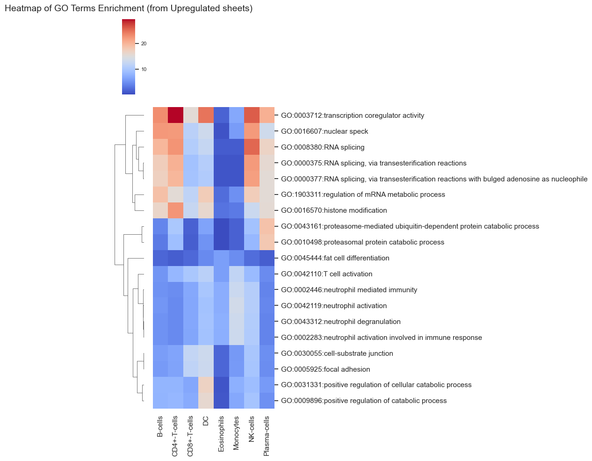

```python
import pandas as pd

#load data from pkl
data = pd.read_pickle("../meta/GO_enrichment_upregulated_genes.pkl")
```


```python
Groups = data.keys()
```


```python
GO_terms = set()
GO_terms_list = []
GO_dict = {}

for g in Groups:
    df = data[g]
    #add first 5 row's go terms to GO_terms
    GO_terms.update(df['ID'].head(5).values)
    for go in df['ID'].head(5).values:
        if (go not in GO_terms_list):
            GO_terms_list.append(go)
            GO_dict[go] = df[df['ID'] == go]['Description'].values[0]

for go in GO_terms_list:
    print(go, GO_dict[go])

```

    GO:0003712 transcription coregulator activity
    GO:0016607 nuclear speck
    GO:0008380 RNA splicing
    GO:1903311 regulation of mRNA metabolic process
    GO:0000375 RNA splicing, via transesterification reactions
    GO:0016570 histone modification
    GO:0030055 cell-substrate junction
    GO:0005925 focal adhesion
    GO:0031331 positive regulation of cellular catabolic process
    GO:0009896 positive regulation of catabolic process
    GO:0043312 neutrophil degranulation
    GO:0002283 neutrophil activation involved in immune response
    GO:0002446 neutrophil mediated immunity
    GO:0042119 neutrophil activation
    GO:0045444 fat cell differentiation
    GO:0042110 T cell activation
    GO:0000377 RNA splicing, via transesterification reactions with bulged adenosine as nucleophile
    GO:0043161 proteasome-mediated ubiquitin-dependent protein catabolic process
    GO:0010498 proteasomal protein catabolic process
    


```python
import numpy as np

sheet = pd.DataFrame(index=GO_terms_list, columns=Groups)

for g in Groups:
    df = data[g]
    for go in GO_terms_list:
        if (go in df['ID'].values):
            sheet.loc[go, g] = -np.log10(df[df['ID'] == go]['pvalue'].values[0])
        else:
            sheet.loc[go, g] = 0

sheet = sheet.apply(pd.to_numeric, errors='coerce')

# display(sheet)
```


```python
import pandas as pd
import seaborn as sns
import matplotlib.pyplot as plt

sheet_annotated = sheet.copy()
sheet_annotated.index = [f"{go}:{GO_dict.get(go, '')}" for go in sheet.index]

sns.set(style="white")

# display(sheet_annotated)

fig = sns.clustermap(
    sheet_annotated,
    cmap="coolwarm",
    linewidths=0,
    figsize=(10.5, 10),
    cbar_kws={'label': '-log10(P value)'},
    row_cluster=True,
    col_cluster=False,
)
cbar = fig.ax_cbar

# cbar.set_position((-0.50, 0.5, 0.03, 0.4))
cbar.set_aspect(0.2)

plt.xlabel('')
plt.ylabel('')
plt.xticks(rotation=90, ha='center')
plt.yticks(fontsize=8)

plt.title('Heatmap of GO Terms Enrichment (from Upregulated sheets)', fontsize=14, pad=12)

plt.savefig("../figure/GO_enrichment_upregulated_genes_heatmap.png", dpi=300, bbox_inches='tight')

plt.tight_layout()
plt.show()

```


    

    

