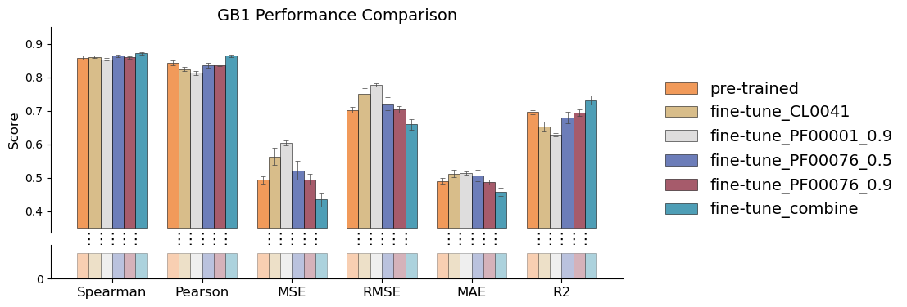

```python
import json
import pandas as pd

GB1_DATA = pd.read_csv(r'../data/GB1.csv', index_col=0)

INDEX = GB1_DATA.index
COLUMNS = GB1_DATA.columns

display(INDEX)
display(COLUMNS)
```


    Index(['Spearman', 'Pearson', 'MSE', 'RMSE', 'MAE', 'R2'], dtype='object')


    Index(['pre-trained-mean', 'pre-trained-std', 'fine-tune_CL0041-mean',
           'fine-tune_CL0041-std', 'fine-tune_PF00001_0.9-mean',
           'fine-tune_PF00001_0.9-std', 'fine-tune_PF00076_0.5-mean',
           'fine-tune_PF00076_0.5-std', 'fine-tune_PF00076_0.9-mean',
           'fine-tune_PF00076_0.9-std', 'fine-tune_combine-mean',
           'fine-tune_combine-std'],
          dtype='object')


```python
methods = []

for col in COLUMNS:
    if (col[-4:] == 'mean') and (col[:-5] not in methods):
        methods.append(col[:-5])

values = {}
errors = {}

for method in methods:
    vals, errs = [], []
    for entry in GB1_DATA[method + "-mean"]:
        vals.append(float(entry))
    for entry in GB1_DATA[method + "-std"]:
        errs.append(float(entry))
    values[method] = vals
    errors[method] = errs

display(methods)
# display(values)
# display(errors)
```


    ['pre-trained',
     'fine-tune_CL0041',
     'fine-tune_PF00001_0.9',
     'fine-tune_PF00076_0.5',
     'fine-tune_PF00076_0.9',
     'fine-tune_combine']


```python
pallete_name = 'pallete_new3'
# pallete_name = 'pallete_raw'
pallete = json.load(open(f'../graphql/{pallete_name}.json', 'r'))
display(pallete)
```


    ['#ED7823', '#CCA763', '#D3D2D2', '#3B51A2', '#89243A', '#127E9E']


```python
import numpy as np
import matplotlib.pyplot as plt

x = np.arange(len(INDEX))
width = 0.13

fig, ax = plt.subplots(
    2, 1,
    figsize=(9, 4),
    gridspec_kw={
        'height_ratios': [6, 1],
        'hspace': 0.11
        }
    )

baseline = 0.35
buns = (0, 0.3)

for i, method in enumerate(methods):
    heights = np.array(values[method])
    heights -= baseline
    ax[0].bar(
        x + i * width,
        heights,
        bottom = baseline,
        width = width,
        yerr = errors[method],
        capsize = 2.5,
        label = method,
        color = pallete[i],
        edgecolor = "black",
        linewidth = 0.5,
        alpha = 0.75,
        error_kw = dict(ecolor="#444444", lw=0.5, capthick=0.5)
    )

for i, method in enumerate(methods):
    heights = [buns[1]] * len(INDEX)
    bottoms = [buns[0]] * len(INDEX)
    ax[1].bar(
        x + i * width,
        heights,
        bottom = bottoms,
        width = width,
        label = method,
        color = pallete[i],
        edgecolor = "black",
        linewidth = 0.5,
        alpha = 0.35,
    )

ax[0].set_ylabel("Score", fontsize=12)
ax[0].set_title("GB1 Performance Comparison", fontsize=14)

ax[0].set_xticks(x + width * (len(methods) - 1) / 2)
ax[0].set_xticklabels([])

ax[0].set_ylim(baseline - 0.01, 0.95)

ax[0].spines["top"].set_visible(False)
ax[0].spines["right"].set_visible(False)
ax[0].spines["bottom"].set_visible(False)

ax[1].spines["top"].set_visible(False)
ax[1].spines["right"].set_visible(False)

#hide the xticks line in ax[0]
ax[0].tick_params(axis='x', which='both', length=0)

# complete copy the xticks and xlim from ax[0] to ax[1]
ax[1].set_xlim(ax[0].get_xlim())
ax[1].set_xticks(x + width * (len(methods) - 1) / 2)
ax[1].set_xticklabels(INDEX, fontsize=12)

ax[1].set_ylim(buns[0], buns[1] + 0.1)

ax[1].set_yticks([0])

ax[0].legend(
    bbox_to_anchor=(1.05, 0.4),
    loc="center left",
    frameon=False,
    fontsize=14
)

for i in range(len(methods) - 1):
    for xpos in x + width * (i + 0.5):
        ax[0].text(
            xpos,
            -0.0,
            "⋮",
            transform=ax[0].get_xaxis_transform(),
            ha="center",
            va="top",
            fontsize=14,
            color="black"
        )

plt.savefig(rf"../figure/GB1/test_{pallete_name}.png", dpi=300, bbox_inches='tight')
plt.savefig(rf"../figure/GB1/test_{pallete_name}.pdf", bbox_inches='tight')
plt.show()
```


    

    

